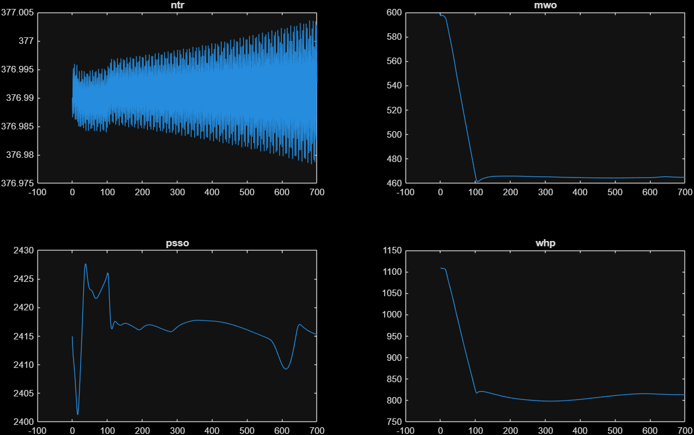
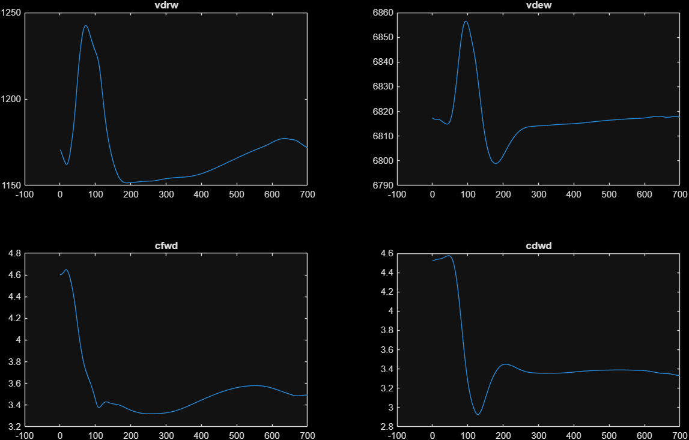
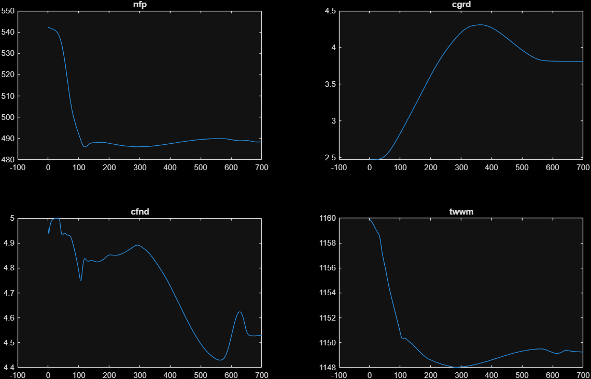

# Model notes — Usoro 47th-order Digital Model (legacy flat-script code)

> **ARCHIVED.** The code documented here lives in `deprecated/old/` and is
> kept only as an audit trail. The current implementation (validated
> bit-for-bit against `deprecated/old/digpte47.m`, see
> [README.md](README.md) in this folder) is `src/+model`, documented in
> `docs/model.md`.

Reference: P. B. Usoro, *Modeling and Simulation of a Drum Boiler-Turbine Power
Plant Under Emergency State Control*, M.S. thesis, MIT, May 1977
([DSpace hdl:1721.1/16301](https://dspace.mit.edu/handle/1721.1/16301)).
Page numbers below refer to the thesis PDF.

## State vector

`x` as unpacked in `digpte47.m` (and `pba1_240814bk.m`). States 1–22 plus 47
are the 23 "physical" states; 23–46 are the 24 control-system states.

### Physical states

| # | Name | Unit | Description (thesis section) |
|---|---|---|---|
| 1 | `nfp` | rad/s | Boiler feed pump turbine speed (Boiler Feed Pump & Booster Pump, p. 159) |
| 2 | `hhho` | Btu/lb | HP feedwater heater outlet enthalpy (p. 161) |
| 3 | `heco` | Btu/lb | Economizer outlet feedwater enthalpy |
| 4 | `vdrw` | ft³ | Drum water volume (Drum, saturated equilibrium) |
| 5 | `rdrs` | lb/ft³ | Drum steam density |
| 6 | `nrp` | rad/s | Recirculation pump speed |
| 7 | `twwm` | °R | Waterwall metal temperature |
| 8 | `rpso` | lb/ft³ | Primary superheater outlet steam density |
| 9 | `hpso` | Btu/lb | Primary superheater outlet enthalpy |
| 10 | `rsso` | lb/ft³ | Secondary superheater outlet density |
| 11 | `hsso` | Btu/lb | Secondary superheater outlet enthalpy (main steam) |
| 12 | `rsco` | lb/ft³ | Steam chest density (governing stage) |
| 13 | `rrho` | lb/ft³ | Reheater outlet steam density |
| 14 | `hrho` | Btu/lb | Reheater outlet enthalpy |
| 15 | `rcro` | lb/ft³ | Cross-over pipe steam density |
| 16 | `ntr` | rad/s | Turbine–generator shaft speed (Turbine-Generator, pp. 152–153) |
| 17 | `ncp` | rad/s | Condensate pump speed |
| 18 | `hlho` | Btu/lb | LP feedwater heater outlet enthalpy |
| 19 | `vdew` | ft³ | Deaerator water volume |
| 20 | `rdes` | lb/ft³ | Deaerator steam density |
| 21 | `nfd` | rad/s | Forced-draft fan speed |
| 22 | `nid` | rad/s | Induced-draft fan speed |
| 47 | `delta` | rad | Generator power angle (swing equation, p. 153) |

### Control-system states

Controller integrators (PI action) and first-order actuator/demand lags
(thesis Ch. IV). The `%NN` comments in the code refer to the thesis block
numbers.

| # | Name | Loop |
|---|---|---|
| 23 | `c3md` | Boiler master demand integrator (throttle pressure error) |
| 24 | `c5ar` | Air flow control integrator |
| 25 | `c5fl` | Fuel flow control integrator |
| 26 | `c3fn` | Furnace pressure control integrator |
| 27 | `c2gr` | Gas recirculation integrator |
| 28 | `c2ft` | Feed pump turbine control integrator (FW valve ΔP set) |
| 29 | `c3fv` | Feedwater control, level-loop integrator |
| 30 | `c7fv` | Feedwater control, flow-loop integrator |
| 31 | `c3dv` | Deaerator level control integrator |
| 32 | `c8dv` | Deaerator level control, second integrator |
| 33 | `c5rh` | Reheat temperature control integrator (burner tilt) |
| 34 | `c5sy` | Superheat temperature control integrator (spray) |
| 35 | `card` | Combustion air demand lag → FD fan vanes `avf` |
| 36 | `cfld` | Fuel flow demand lag → `wfl` |
| 37 | `cfnd` | Furnace pressure demand lag → ID fan vanes `avi` |
| 38 | `cgrd` | Gas recirculation demand lag → `wgr` |
| 39 | `cftd` | Feed pump turbine steam demand lag → `wft` |
| 40 | `cfwd` | Feedwater valve demand lag → `afv` |
| 41 | `cdwd` | Deaerator valve demand lag → `adv` |
| 42 | `cxggd` | Burner tilt demand lag → `xgg` |
| 43 | `csyd` | Superheat spray demand lag → `wsy` |
| 44 | `c2tr` | Turbine control (load reference) integrator |
| 45 | `c4tr` | Turbine load demand lag |
| 46 | `cacvd` | Governor control valve demand lag → `agv` |

## Control loops (thesis Ch. IV)

All controller signals live on a normalized 1–5 scale (`limchk` clamps to
[1, 5]; `xducer` converts between physical ranges and the 1–5 control scale).
The plant runs in **boiler-following mode**: the turbine takes the load
(governor valves respond to load demand `ldc` and speed error), and the boiler
master trims firing to restore throttle pressure (set point 2415 psia).

1. **Boiler master** (`c*md`): throttle pressure error → PI → common demand
   `cbmd` for the air and fuel loops, with a speed-error assist term.
2. **Air flow** (`c*ar`): `cbmd` cross-limited with measured fuel demand
   (takes the max) → PI → `card` lag → FD fan inlet vanes.
3. **Fuel flow** (`c*fl`): `cbmd` cross-limited with measured air flow
   (takes the min — classic lead-lag combustion cross-limits) → PI → `cfld`
   lag → fuel valve.
4. **Furnace pressure** (`c*fn`): furnace draft error + air-flow feedforward →
   PI → `cfnd` lag → ID fan inlet vanes.
5. **Gas recirculation** (`c*gr`): follows burner tilt out-of-range condition;
   sets recirculated gas flow (reheat steam temperature support).
6. **Feed pump turbine** (`c*ft`): holds feedwater-valve differential pressure
   (`pfvd`) at set point by adjusting extraction steam flow `wft` to the feed
   pump turbine.
7. **Feedwater** (`c*fv`): three-element control — drum level (`xdrw`) PI
   cascaded with steam-flow/feedwater-flow balance (`p1st` vs `wfw+wsy`) →
   feedwater valve area `afv`.
8. **Deaerator level** (`c*dv`): deaerator level PI plus condensate
   pressure/flow trim → deaerator valve area `adv`.
9. **Reheat temperature** (`c*rh`): reheater outlet temperature error → PI →
   burner tilt demand `cxggd` (tilting the flames changes the split between
   furnace radiation and convective surfaces).
10. **Superheat temperature** (`c*sy`): main steam temperature error → PI →
    desuperheater spray flow demand `csyd`.
11. **Turbine / governor** (`c*tr`): load demand `ldc` vs generated power PI
    (load reference motor `c2tr`, rate-limited), plus proportional speed
    regulation (droop `kcvreg`) → governor valve demand `cacvd`.

Set points that depend on load (`ktrh`, `ktss`) are scheduled on HP steam flow
`whp`.

## Module ↔ thesis correspondence

Physical property functions are polynomial *steam table fits* (thesis App. —
"Steam Table Fits" under each component):

| File | Computes |
|---|---|
| `drstat.m` | Drum saturation properties from steam density `rdrs` |
| `destat.m` | Deaerator saturation properties from `rdes` |
| `shstat.m` | Superheated steam `p,T,s` from `ρ,h` (superheaters) |
| `rhstat.m` | Reheater steam `p,T,s` from `ρ,h` |
| `fwstat.m` | Feedwater (compressed liquid) `ρ,T` from `h,p` |
| `cwstat.m` | Condensate water `ρ,T` from `h,p` |
| `cpstat.m` | Condensate pump outlet `h,T` |
| `fpstat.m` | Feed pump outlet `h,T` |
| `hpstat.m` | HP turbine outlet state via isentropic efficiency `ehp` |
| `crstat.m` | IP turbine outlet / cross-over state via `eip` |
| `cnstat.m` | Condenser state from `pcn` and exhaust quality |
| `lsstat.m` / `lwstat.m` | Extraction heater steam / water saturation states |
| `rwstat.m` | Recirculating water states |
| `systat.m` / `rystat.m` | Superheat / reheat spray mixing states |

Flows, heat transfer and machines:

| File | Computes |
|---|---|
| `shflow.m` | Steam flow from momentum balance `w = √(ρ·Δp/K)` |
| `fwflow.m` | Feedwater network: booster + main feed pump curves solved in closed form (quadratic) for `wfp`, pressures along the train, pump efficiency `efp` (p. 159–161) |
| `cwflow.m` | Condensate network: condensate pump, LP heaters, deaerator valve |
| `rwflow.m` | Recirculation loop: pump curve, downcomer flow |
| `arflow.m` | Air–gas path: FD/ID fans, furnace draft, gas recirculation |
| `fnxfer.m` | Furnace: flame temperature, waterwall radiant absorption `qwwgm`, radiation to primary superheater `qpsr` |
| `hxfer.m` | Convective heat exchanger transfer (applied in gas-path order: primary SH → secondary SH → reheater → economizer) |
| `hpext.m` / `ipext.m` / `lpext.m` | HP / IP / LP turbine extraction flows and enthalpies for the regenerative feedwater heaters |
| `torque.m` | Induction motor torque from slip curve (recirc/condensate pumps, FD/ID fans) |
| `fpturb.m` | Feed pump turbine driving torque from extraction steam |
| `drum.m` | Two-state (volume, density) saturated vessel balances — used for both drum and deaerator |
| `destmr.m` | Deaerator steam sources (extraction, vents, blowdown) |
| `averag.m` | Three-pair averaging helper for mean section properties |
| `xducer.m` | Range transducer with saturation |
| `limchk.m` / `check.m` | Limiters |

## The turbine–generator swing pair and the integration scheme

Thesis pp. 152–153:

```
Kjtre · dNtr/dt = (MWtro − MWgn)/Ntr        (moment of momentum)
MWgn  = Kmwr · MWgnpu,   MWgnpu = 2 sin δ    (generator action, infinite bus)
dδ/dt = Ntr − Nelec                          (power angle)
```

Damping is deliberately omitted. Linearized about δ₀ ≈ 0.524 rad this is an
undamped oscillator with ωₙ = √(2·Kmwr·cos δ₀/(Ntr·Kjtre)) ≈ 1.8 rad/s.

Consequences for integration at Ts = 0.1 s:

- **Explicit Euler** (what the frozen-derivative `ode45(dxdt=const)` scheme in
  `pba1_240814bk.m` amounts to): amplification |1 + iωh| > 1 → divergence.
  This is why `xdot(1)` and `xdot(16)` were hardcoded to zero there.
- **Classic RK4** (`pba2_rk4.m`, same as the thesis's DYSYS run at 0.1 s):
  |R(iωh)| < 1 for 0 < ωh < 2√2 → stable with negligible artificial damping
  (ωh ≈ 0.18).

The feed pump speed `nfp` is not oscillatory — its net-torque derivative gives
a time constant of tens of seconds — but it was frozen along with `ntr` in the
original port and is likewise restored in `digpte47.m`.

## The `crstat.m` isentropic-efficiency fix

The adiabatic-expansion relation used throughout the thesis (pp. 145, 149) is

```
h_out = h_in − η_isen · (h_in − h_isen)
```

`hpstat.m` implements this correctly for the HP turbine. `crstat.m` (IP
turbine → cross-over pipe) had `ho = hi − ef·(h1 − hi)` — anchored at the
isentropic enthalpy `hi` rather than the inlet enthalpy `h1`, an easy slip
because the thesis FORTRAN listing (`SUBROUTINE CRSTAT`, scanned p. ~283) is
OCR-ambiguous between `H1` and `HI`.

Verification of the corrected form at the thesis 100% initial conditions:

| Quantity | Buggy | Fixed | Check |
|---|---|---|---|
| `hcro` (Btu/lb) | 1209.7 | 1380.2 | — |
| `pcro` (psia) / `tcro` (°F) | 125.8 / 367 | 173.2 / 709 | buggy value is below saturation — unphysical |
| FP-turbine steam `wft` needed to carry the 13.0 MW pump load (lb/s) | 81.9 (> transducer max 50) | 38.42 | thesis IC: **38.4212** — 4-digit match |
| `xdot(1)` at t = 0 (rad/s²) | −4.35 | −0.002 | equilibrium restored |

The bug was invisible in the frozen-speed `pba1` because the IP-power surplus
and LP-power deficit it caused nearly cancel in `mwtro`, and the feed pump
torque balance was never evaluated.

A second thesis-data issue was found later while reproducing Test 6: the
listed turbine-generator inertia `kjtre = 625000` implies an unphysical
inertia constant (H ≈ 88 s) and makes the swing pair lose synchronism under
the thesis's own frequency-ramp test; it is evidently a WR² in lbm·ft²
needing division by g_c = 32.174. The legacy code here keeps the
as-listed value; the OOP model applies the correction — see
[model.md](model.md), "The kjtre units correction".

## Validation of the un-frozen model (Test 1)

`pba2_rk4.m` (all 47 states live, `crstat` fixed) reproduces thesis Figure V.1
(pp. 65–70) closely. Key comparisons from a full 700 s run:

| Quantity | This model | Thesis |
|---|---|---|
| Power output | 599 → 465.0 MW, min 461.5 (0.75% undershoot) | 600 → 465 MW, ≈1% undershoot (p. 51) |
| Throttle pressure | 2401–2428, ends 2415.3 psia | rises during ramp, returns to 2415 psia |
| Turbine speed | 376.99 ± 0.005 rad/s | "virtually constant" at 377 (p. 50) |
| Governor valve | 5.0 → 3.67 | 5.0 → ≈3.65 (Fig. V.1 p. 66) |
| Drum water volume | peak 1242 / min 1151 / ends 1172 ft³ | peak ≈1238 / min ≈1143 / ends ≈1170 (p. 67) |
| Deaerator volume | peak 6857 / min 6799 / ends 6818 ft³ | peak ≈6852 / min ≈6798 / ends ≈6820 (p. 67) |
| Condensate control | dip to 2.93, settles 3.35 | dip to ≈2.97, settles ≈3.38 (p. 67) |
| LP heater `hlho` (77.5%) | 186.9 Btu/lb | 186.7 (Table V.2) |
| Deaerator pressure (77.5%) | ≈45 psia (`rdes`=0.1064) | 45.3 psia (Table V.2) |
| Feed pump speed | 542 → 488 rad/s, tracks the ramp | (not tabulated) |





Known characteristic: the `ntr` swing mode (±0.005 rad/s, i.e. 0.001% of
rated speed) shows a very slow envelope growth (~×1.4 over 700 s) because the
model contains **zero** generator damping and the lagged governor pumps the
mode slightly. It is invisible at thesis plot scale over Test-1 duration. For
much longer runs, adding a small damper-winding term
`− kd·(ntr − nelec)` inside `xdot(16)`'s numerator (kd of order 1–2 pu power
per pu speed, i.e. `kd ≈ 2·kmwr/nelec`) would bound it, at the cost of a
deliberate deviation from the thesis equations.

Combustion-side signal levels at 77.5% sit slightly above the thesis plots
(e.g. fuel demand ≈4.07 vs ≈3.8) — consistent with the `crstat` fix shifting
the cycle heat balance; loop shapes and settling behavior match.

## Scenarios and initial conditions

- `diginit100.m` — 100% load (`ldc = 5`, 600 MW), thesis p. 288 values.
- `diginit775.m` — 77.5% load (`ldc = 3.875`, 465 MW).
- `diginit50.m` — 50% load (`ldc = 2.5`, 300 MW).

The simulated scenario is thesis **Test 1** (V.1, p. 50): 10 s at steady
state, then `ldc` ramps 5 → 3.875 over 90 s (15%/min), then holds to t = 700 s.
The ramp is implemented in `digpte47.m` as a function of `t`; edit it (or make
`ldc` an input) to reproduce thesis Tests 2–7 (load increase, frequency/voltage
disturbance, equipment failure).

Note: `mwgnpu = 2 sin δ` means rated power corresponds to `sin δ = 0.5`
(δ = 0.5236 rad = 30°); `kmwr = 4.428e8` ft·lbf/s ≈ 600 MW; `kmwx` converts
ft·lbf/s to MW.
