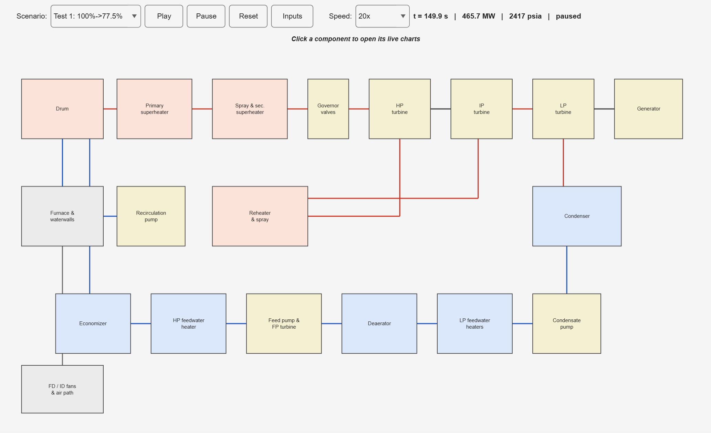
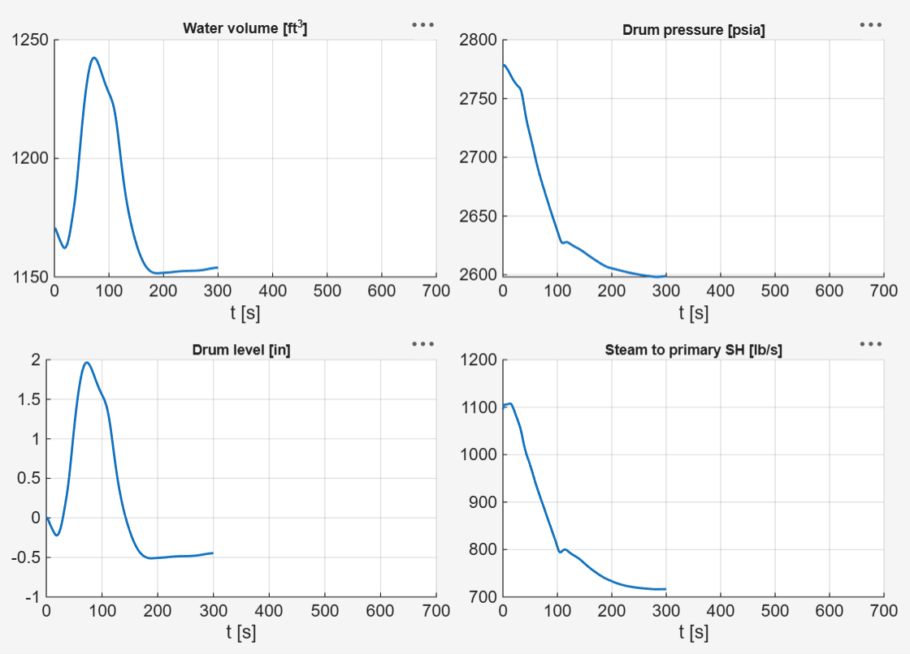
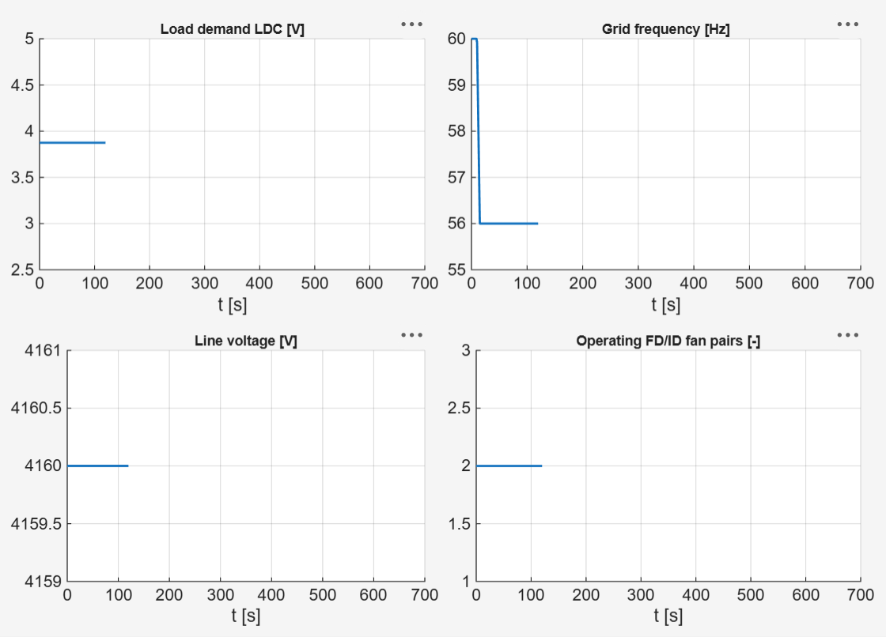
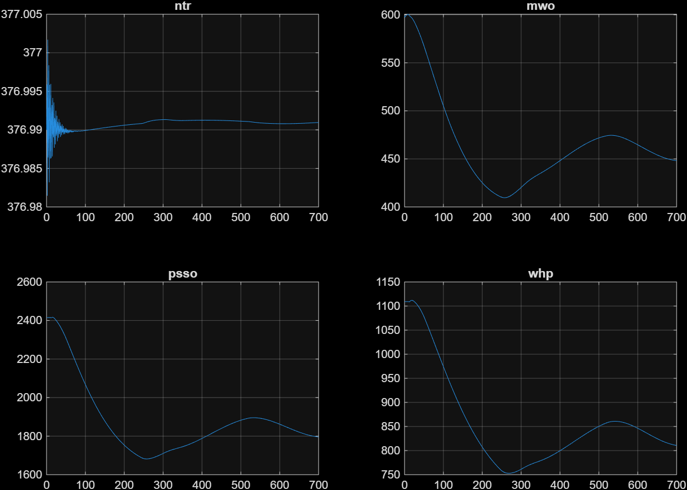
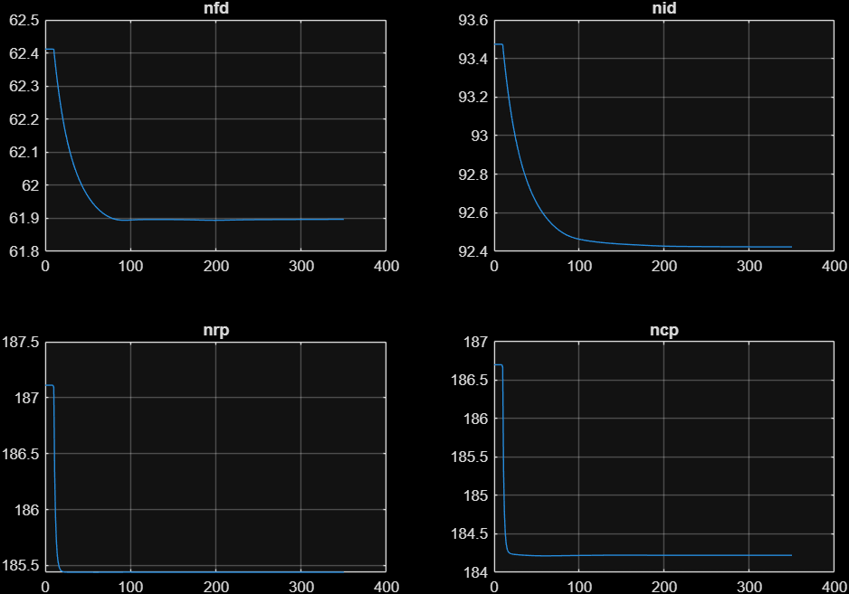
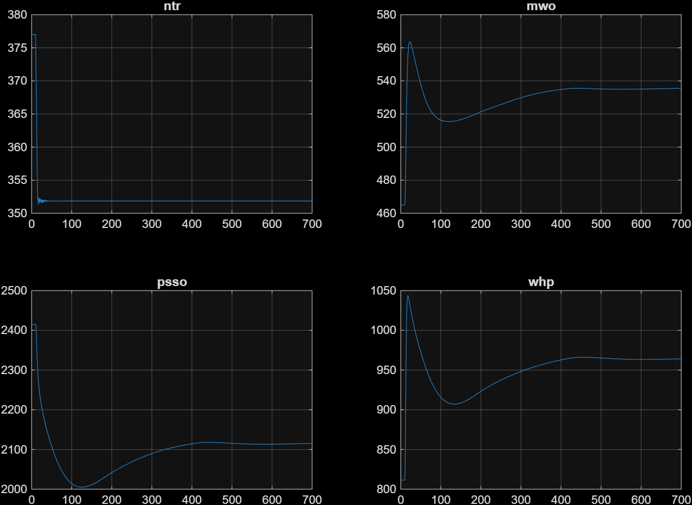

# Usoro Digital Model — architecture and usage

Object-oriented MATLAB implementation of the 47th-order Digital Model from
Usoro's 1977 MIT thesis, living in the `src/+model` package. Every equation,
fit and constant is transcribed from the thesis FORTRAN listing and data
deck (the thesis background and listing landmarks are in
[thesis_notes.md](thesis_notes.md)); two documented deviations from the
as-printed deck are the `crstat` cross-over anchoring (an OCR-ambiguous
line, resolved by the feed-pump torque balance — see
`SteamTables.crossoverSteam`) and the `kjtre` units correction (section
below).

## Package layout (`src/+model`)

| Class | Kind | Role |
|---|---|---|
| `Parameters` | value, **generated** | all 306 plant/control constants as properties, thesis symbol names (thesis `CONST1`–`CONST3` + data deck) |
| `StateVector` | static | state indices, names, `unpack(x)` → named struct |
| `InitialConditions` | static | canonical 100%-load state (thesis p. 288) |
| `SteamTables` | static | 16 water/steam property fits (thesis `*STAT` subroutines) |
| `Hydraulics` | static | closed-form flow-network solvers (thesis `*FLOW` subroutines) |
| `Turbomachinery` | static | extraction fits, motor and FP-turbine torque (`HPEXT`, `IPEXT`, `LPEXT`, `TORQUE`, `FPTURB`) |
| `HeatTransfer` | static | furnace radiant balance, convective exchangers (`FNXFER`, `HXFER`) |
| `VesselDynamics` | static | saturated-vessel balances, deaerator steam (`DRUM`, `DESTMR`) |
| `PowerPlant` | handle | physical process model: algebra + states 1–22, 47 |
| `ControlSystem` | handle | actuator transducers (`XDUCER`, `LIMCHK`, `CHECK`) + the 11 loops: states 23–46 |
| `LoadProfile` | value | LDC demand `ldc(t)`; swappable scenarios |
| `GridProfile` | value | grid frequency `nelec(t)` and voltage `velec(t)`; enables the electrical emergency tests |
| `Simulator` | handle | RK4 integration, logging, `f(t,x)` assembly |

Plus the `src/+test` package — `test.run1` … `test.run7`, one function per
thesis test, each returning the simulation results — the dashboard
(`src/PlantApp.m`, launcher `src/run_ui.m`) and
`src/tools/trim_operating_points.m` (generates the trimmed 77.5% and 50%
operating points `+model/ic775.mat` / `+model/ic50.mat` needed by
Tests 2–7).

## State vector

States 1–22 and 47 are the 23 physical states; 23–46 are the 24
control-system states. Indices and helpers: `model.StateVector`.

| # | Name | Unit | Description |
|---|---|---|---|
| 1 | `nfp` | rad/s | Boiler feed pump turbine speed (thesis p. 159) |
| 2 | `hhho` | Btu/lb | HP feedwater heater outlet enthalpy (p. 161) |
| 3 | `heco` | Btu/lb | Economizer outlet feedwater enthalpy |
| 4 | `vdrw` | ft³ | Drum water volume |
| 5 | `rdrs` | lb/ft³ | Drum steam density |
| 6 | `nrp` | rad/s | Recirculation pump speed |
| 7 | `twwm` | °R | Waterwall metal temperature |
| 8 | `rpso` | lb/ft³ | Primary superheater outlet steam density |
| 9 | `hpso` | Btu/lb | Primary superheater outlet enthalpy |
| 10 | `rsso` | lb/ft³ | Secondary superheater outlet density |
| 11 | `hsso` | Btu/lb | Secondary superheater outlet enthalpy (main steam) |
| 12 | `rsco` | lb/ft³ | Steam chest density (governing stage) |
| 13 | `rrho` | lb/ft³ | Reheater outlet steam density |
| 14 | `hrho` | Btu/lb | Reheater outlet enthalpy |
| 15 | `rcro` | lb/ft³ | Cross-over pipe steam density |
| 16 | `ntr` | rad/s | Turbine–generator shaft speed (pp. 152–153) |
| 17 | `ncp` | rad/s | Condensate pump speed |
| 18 | `hlho` | Btu/lb | LP feedwater heater outlet enthalpy |
| 19 | `vdew` | ft³ | Deaerator water volume |
| 20 | `rdes` | lb/ft³ | Deaerator steam density |
| 21 | `nfd` | rad/s | Forced-draft fan speed |
| 22 | `nid` | rad/s | Induced-draft fan speed |
| 47 | `delta` | rad | Generator power angle (swing equation, p. 153) |

Control-system states (thesis Ch. IV): PI integrators `c3md` (23, boiler
master), `c5ar` (24, air), `c5fl` (25, fuel), `c3fn` (26, furnace
pressure), `c2gr` (27, gas recirculation), `c2ft` (28, FP turbine),
`c3fv`/`c7fv` (29/30, feedwater level/flow), `c3dv`/`c8dv` (31/32,
deaerator level), `c5rh` (33, reheat temperature), `c5sy` (34, superheat
temperature), `c2tr` (44, load reference) and `c4tr` (45, load demand
lag); first-order demand lags `card` (35, air → FD vanes `avf`), `cfld`
(36, fuel → `wfl`), `cfnd` (37, furnace pressure → ID vanes `avi`),
`cgrd` (38, gas recirc → `wgr`), `cftd` (39, FP-turbine steam → `wft`),
`cfwd` (40, feedwater valve → `afv`), `cdwd` (41, deaerator valve →
`adv`), `cxggd` (42, burner tilt → `xgg`), `csyd` (43, superheat spray →
`wsy`) and `cacvd` (46, governor valve → `agv`).

## Control loops (thesis Ch. IV)

All controller signals live on a normalized 1–5 V scale (`limchk` clamps
to [1, 5]; `xducer` converts between physical ranges and the control
scale). The plant runs in **boiler-following mode**: the turbine takes the
load (governor valves respond to load demand `ldc` and speed error), and
the boiler master trims firing to restore throttle pressure (set point
2415 psia).

1. **Boiler master** (`c*md`): throttle pressure error → PI → common
   demand for the air and fuel loops, with a speed-error assist term.
2. **Air flow** (`c*ar`): cross-limited with fuel demand (takes the max)
   → PI → `card` lag → FD fan inlet vanes.
3. **Fuel flow** (`c*fl`): cross-limited with measured air flow (takes
   the min — classic combustion cross-limits) → PI → `cfld` lag → fuel
   valve.
4. **Furnace pressure** (`c*fn`): furnace draft error + air-flow
   feedforward → PI → `cfnd` lag → ID fan inlet vanes.
5. **Gas recirculation** (`c*gr`): integrates while the burner tilt is
   outside its ±5° deadband; sets recirculated gas flow (reheat
   temperature support).
6. **Feed pump turbine** (`c*ft`): holds feedwater-valve differential
   pressure (`pfvd`) at set point via extraction steam flow `wft`.
7. **Feedwater** (`c*fv`): three-element control — drum level (`xdrw`) PI
   cascaded with steam-flow/feedwater-flow balance → feedwater valve
   area `afv`.
8. **Deaerator level** (`c*dv`): level PI plus condensate pressure/flow
   trim → deaerator valve area `adv`.
9. **Reheat temperature** (`c*rh`): reheater outlet temperature error →
   PI → burner tilt demand `cxggd` (tilting the flames shifts the
   furnace-radiation / convective-surface split).
10. **Superheat temperature** (`c*sy`): main steam temperature error →
    PI → desuperheater spray flow demand `csyd`.
11. **Turbine / governor** (`c*tr`): load demand `ldc` vs generated power
    PI (rate-limited load reference), plus proportional speed regulation
    (droop `kcvreg`) → governor valve demand `cacvd`.

Load-dependent set points (`ktrh`, `ktss`) are scheduled on HP steam flow
`whp` and clamped to their operating bands.

## Data flow per derivative evaluation

```
Simulator.derivative(t, x)
  ├─ s   = StateVector.unpack(x)            named state struct
  ├─ ldc = LoadProfile.demand(t)            scenario input
  ├─ g   = GridProfile at t                 nelec(t), velec(t)
  ├─ u   = ControlSystem.actuatorCommands(s)
  │        demand states (35-43, 46) ── xducer ──> valve/vane areas,
  │        fuel, spray, gas-recirc and FP-turbine steam flows
  ├─ [xdotPhys, sig] = PowerPlant.evaluate(s, u)
  │        thermoStates → steamPathAndTurbines → waterSide
  │        → mixingAndHeaters → airGasSide → effectiveMasses
  │        → vesselBalances → machines → physicalDerivatives
  │        (sig accumulates every intermediate under its thesis name)
  ├─ xdotCtrl = ControlSystem.derivatives(s, u, sig, ldc)
  │        boiler master → air → fuel → furnace pressure → gas recirc
  │        → FP turbine → feedwater → deaerator level → reheat temp
  │        → superheat temp → turbine/governor
  └─ xdot = xdotPhys + xdotCtrl             (disjoint index ranges)
```

The `sig` struct is the plant "signal bus": the control loops read their
measured variables from it (`psso`, `war`, `pfn`, `pfvd`, `wfw`, `p1st`,
`xdrw`, `pdrs`, `prho`, `wcw`, `xdew`, `trho`, `whp`, `tsso`, `mwtro`, …),
and the logger picks its columns from it.

## Running

```matlab
addpath src
test.run1          % Test 1: load ramp 100% -> 77.5%   (Fig. V.1,  pp. 65-70)
test.run2          % Test 2: load ramp 77.5% -> 50%    (Fig. V.3,  pp. 75-80)
test.run3          % Test 3: load ramp 50% -> 77.5%    (Fig. V.5,  pp. 85-90)
test.run4          % Test 4: load ramp 77.5% -> 100%   (Fig. V.7,  pp. 95-100)
test.run5          % Test 5: 30% voltage drop          (Fig. V.9,  pp. 105-110)
test.run6          % Test 6: frequency drop 60->56 Hz  (Fig. V.10, pp. 111-116)
test.run7          % Test 7: loss of an FD/ID fan pair (Fig. V.11, pp. 117-122)
```

Tests 2–7 need the trimmed operating points — run
`src/tools/trim_operating_points.m` once first (~2 min) if
`+model/ic775.mat` / `+model/ic50.mat` are missing. Custom load ramps:
`model.LoadProfile.ramp(ldc0, ldc1, tStart, rate)` (`ldc` = 5 × load
fraction; thesis rate 15%/min = 0.0125 V/s is the default).

## Interactive dashboard (`PlantApp`)

`run_ui` (or `app = PlantApp();`) opens an interactive dashboard: a
schematic of the plant whose component blocks are clickable — each opens a
window with four live charts of that component's key variables — plus a
scenario dropdown (thesis Tests 1–7 or a steady 100% hold),
Play/Pause/Reset, an **Inputs** button (live charts of what the plant is
receiving: LDC load demand, grid frequency, line voltage, operating
fan-pair count) and a speed selector (1×/5×/20×/Max real time). The status
bar shows t, power output and throttle pressure live.





Implementation notes (`src/PlantApp.m`, programmatic `uifigure` app — no
binary `.mlapp`):

- The simulation advances through `model.Simulator.step` (the same RK4
  scheme as `run`, exposed as a public single-step method), driven by a
  MATLAB `timer`; the speed selector sets steps per tick.
- Every step, one signal sample (states + `sig` bus + actuators) is stored
  in a preallocated buffer; open chart windows redraw from the buffer at
  the UI rate, so charts can be opened mid-run and show full history.
- The component registry inside `PlantApp` maps each diagram block to its
  four charted signals — extend it to add blocks or change signals.
- Test 7's fan-count step is handled as two simulator phases switched at
  t = 10 s, exactly as in `test.run7`.

Or programmatically:

```matlab
par = model.Parameters();
sim = model.Simulator(model.PowerPlant(par), ...
                      model.ControlSystem(par), ...
                      model.LoadProfile.test1());
res = sim.run(model.InitialConditions.at100(), 700);
% res.t, res.X (7001x47 states), res.log / res.logNames (1 Hz signal log)
```

## Extending

- **New scenario:** pass any `ldc(t)` handle —
  `model.LoadProfile(@(t) 5 - 0.025*max(0, min(t,120) - 10))` gives thesis
  Test 2's shape starting from 100%. Grid disturbances take a
  `model.GridProfile` (4th `Simulator` argument): `test5()`, `test6()`, or
  any pair of `nelec(t)`/`velec(t)` handles.
- **Parameter studies:** `Parameters` is a value class — copy and modify:
  `par2 = par; par2.kjtre = 2*par.kjtre;` then build a new plant with it.
- **Control experiments:** subclass `ControlSystem` and override
  `derivatives` (or a future extracted per-loop method); the plant is
  untouched. The rate feedforwards (`fc2dv`, `fcp1st`, `fctrho`, `fcxgg`)
  are public properties maintained as the listing's per-step backward
  differences (`rateFeedforwardsEnabled` turns them off), so a subclass
  or script can also drive them directly.
- **Different integrator:** `Simulator.derivative(t,x)` is public and
  side-effect-free — hand it to `ode45`/`ode15s` directly if wanted
  (`[tt,xx] = ode45(@(t,x) sim.derivative(t,x), [0 700], x0)`), keeping in
  mind the limiters make the RHS non-smooth.

## Conventions and design decisions

- **Thesis names preserved.** Constants (`kjtre`, `kupsgm`, …), signals
  (`wdrs`, `qwwgm`, …) and states keep their thesis/FORTRAN names so the
  code cross-references directly against the thesis. Classes and methods
  follow standard MATLAB style (PascalCase classes, camelCase methods).
- **`Parameters` is generated, not hand-typed.** 306 constants transcribed
  by hand would be a typo lottery; the file is machine-generated and its
  values were verified against the thesis data-deck scan (printed
  pp. 275–286) in Aug 2026. Treat it as read-only data.
- **Subroutine-local fit coefficients stay local** (in `Hydraulics`,
  `HeatTransfer`, etc.) exactly as they are subroutine-local in the thesis
  FORTRAN — they are curve-fit internals, not tunable plant parameters.
- **`PowerPlant` is one class, not eight component objects.** The process
  algebra is a single tightly coupled system solved in a fixed order; the
  subsystem structure is expressed as private methods over the shared `sig`
  bus. Splitting it into independently instantiated component objects would
  add indirection without decoupling anything real.
- **RK4 at 0.1 s** replicates the thesis integration (DYSYS, p. 49). The
  turbine-generator swing pair is deliberately undamped (thesis
  pp. 152–153), a marginally stable oscillator at ≈1.8 rad/s: RK4 is
  (weakly) stable there, while explicit Euler diverges — do not swap in a
  lower-order explicit scheme.
- **Two stepping-level behaviors of the FORTRAN are reproduced in
  `Simulator.step`,** not in the pure RHS: (1) after every step the
  control states are saturated in place (`ControlSystem.clampStates`) —
  the listing passes them to LIMCHK/CHECK by reference, which is the
  analog controllers' anti-windup; (2) the first (committed) stage
  evaluation advances the rate-feedforward backward differences
  (`fc2dv`/`fcp1st`/`fctrho`/`fcxgg`, deck gains ±0.01). Integrating the
  bare `derivative` with an external solver skips both; expect windup
  wherever a loop saturates.

## Load-ramp tests (thesis Tests 2, 3, 4)

All at the thesis 15%/min rate, starting from the trimmed operating points:

- **Test 2** (`test.run2`, 77.5% → 50%): matches Figure V.3 closely —
  power settles 299.9 MW with a 294 MW undershoot (thesis ≈298/295),
  throttle peaks 2437 → returns 2416 psia (thesis 2437 → 2415), main steam
  flow ends 529 lb/s (thesis ≈530).
- **Test 3** (`test.run3`, 50% → 77.5%): power overshoots to 471.8 MW
  (thesis ≈472) and settles 464.9; the throttle-pressure dip is 2349 vs
  the thesis's ≈2354 psia and pressure returns to 2415 within the
  700 s window.
- **Test 4** (`test.run4`, 77.5% → 100%): the thesis calls this run only
  "fairly well behaved" (signals saturate, power lags demand, no
  overshoot). This model reproduces the climb quantitatively and locks
  onto the rated point — at the thesis's 700 s horizon it reads
  600.5 MW at 2415.0 psia with main steam flow ≈1109 lb/s (thesis
  Fig. V.7: 600 MW, 2415 psia, ≈1110 lb/s), and run to 1400 s it stays
  at 600.3 MW ± 0.1 with the air control at ≈4.67 V. The settle depends
  on the fan-curve calibration — see "Known quantitative offsets" below.

## Fan-loss test (thesis Test 7)

`test.run7`: at 100% load, one of the two FD+ID fan pairs is lost at
t = 10 s (no Unit Run-Back; gas recirculation off as in the thesis run).
The fan count is a configuration constant (`knfd`/`knid`), so the script
stitches two phases at t = 10 s. Results track Figure V.11's shape,
recovering *higher* than the figure — the one remaining quantitative
residual (see "Known quantitative offsets"):

| Variable | This model | Thesis Fig. V.11 |
|---|---|---|
| Power dip / recovery | 409.6 → 448.2 MW | ≈371 → ≈420 |
| Throttle pressure min / end | 1682 / 1796 psia | ≈1560 / ≈1700 |
| Main steam flow min / end | 753 / 811 lb/s | ≈690 / ≈770 |
| Air control / governor | rail at 5 V | rail at 5 V |
| Turbine speed | flat 377 | flat 377 |



## Known quantitative offsets

The historic ≈10% fuel/air offset is **resolved** (Aug 2026): it was a
one-character transcription slip in the convective heat-exchanger
subroutine. The printed HXFER listing (card PAT11075) reads
`SG=Z1+Z2*(TG1+TGO)` — the mean of the linear-in-temperature gas specific
heat s(T) = z1 + 2·z2·T across the exchanger, consistent with the
subroutine's own gas-outlet-temperature quadratic — while the port had
`(tg1 - tgo)`, under-counting the heat delivered to the primary/secondary
superheater, reheater and economizer at every load. The fix (applied to
both `HeatTransfer.convective` and `deprecated/old/hxfer.m`, like the
CRSTAT fix) raises the absorbed fraction at the 100% ICs from 80.0% to
87.6% (thesis-implied ≈88%) and makes the thesis p. 288 ICs essentially an
equilibrium (mwo 599.0, psso 2415.0 at the thesis's own 80.14 lb/s fuel).
The re-trimmed operating points now sit on the thesis's published steady
states: at 77.5%, fuel 63.62 lb/s vs Table V.2's 63.3, air 976.6 vs 972.1,
main steam flow 811.4 vs 813.4, drum pressure 2602.1 vs 2603.5.

The air-side table-vs-listing inconsistency is **calibrated out**
(Aug 2026): thesis Table V.1 reports 1230.3 lb/s of air at the 100% steady
state with the air control at only ≈4.55 V (Fig. V.7), but the printed
ARFLOW/deck (verified transcription-clean against the scan, constants
included) delivers at most ≈1219 lb/s with both dampers *full open* at the
IC fan speeds. Since the fuel/air cross-limit needs air ≥ (kwaru/kwflu) ×
wfl = 15.35 × 80.14 ≈ 1230.0 lb/s to sustain 100% fuel, the printed deck
ran the rated point with zero air margin: the cross-limit capped fuel ≈1%
short, and the plant limit-cycled around 100% (574–606 MW, ~400 s period)
instead of holding it. The published runs evidently used stronger fans
than the printed listing, so `Hydraulics.airGas` (mirrored in
`deprecated/old/arflow.m`) applies `kfcal = 1.10` to the six fan ΔP
coefficients — fans of the same speed and vane law developing 10% more
head (≈ +5% deliverable air, full-open ceiling ≈1267 lb/s; fan power
terms k4–k6 stay as printed). The value is pinned by the published
off-design data, not by the 100% point alone: ×1.10 lands Test 6's
frequency-depressed settle on Figure V.10 (535.5 MW / 2115 psia vs
≈537 / 2125; the stock deck gave 515 / 2035, and the ×1.2275 that would
reproduce the 4.55 V damper reading exactly overshoots to 562 / 2225).
A friction-side calibration (×0.822 on the duct constants) was rejected
on the same evidence. With the calibration, the 100% point holds
indefinitely (600.0 MW / 2415.0 psia, air control ≈4.66 V) and Test 4
settles on Table V.1. The remaining residual: Test 7's fan-loss recovery
sits ≈25–30 MW above Figure V.11 (and rises slightly with air capacity —
its published trace is the one datum mildly *against* the calibration).
Verified *not* the cause of the original deficit (Aug 2026 sessions):
every control-deck constant against the scan, the reheat schedule, the
gas-recirculation level, ARFLOW, FNXFER, and HXFER (post-fix).

The gas-recirculation level itself is only loosely pinned by the plant:
the recirc integrator acts only while the burner tilt is outside its ±5°
deadband, so its steady value is path-dependent within a narrow band
(≈355–385 lb/s at 77.5%; the thesis's 337 lb/s lies outside this model's
band — re-seeded there, the plant pumps it back to ≈356).

## Electrical emergency tests (thesis Tests 5 and 6)

Both start from the trimmed 77.5% operating point
(`model.InitialConditions.at775()`, generated by `src/tools/trim_operating_points.m`:
Test-1 ramp + 1300 s settling + damped swing settling + exact pinning of the
swing pair; worst residual ≈ 7e-4).

**Test 5** (`test.run5`): 30% step drop in line voltage at t = 10 s
(4160 → 2912 V). Reproduces thesis Figure V.9 closely — motor torque falls
with voltage², the auxiliaries slow, the controls compensate, the steam side
barely moves:

| Variable | This model | Thesis Fig. V.9 |
|---|---|---|
| Condensate pump speed | 186.7 → 184.2 rad/s in ~10 s | 186.7 → 184.2 |
| Recirculation pump speed | 187.1 → 185.45 in ~10 s | 187 → 185.45 |
| FD fan speed | 62.4 → 61.9, ~100 s | 62.3 → 61.7, ~100 s |
| ID fan speed | 93.5 → 92.4, slow ~150 s | 93.25 → 91.9, ~150 s |
| Power / throttle pressure | flat 465 MW / 2415 psia | flat |
| Feed pump speed | flat (steam-driven) | flat |



**Test 6** (`test.run6`): line frequency ramps 60 → 56 Hz at 0.8 Hz/s from
t = 10 s; gas recirculation control deactivated as in the thesis run.
Turbine speed drops with the grid to 351.9 rad/s exactly as in Figure V.10;
governor and air-flow controls rail at 5 V (as in the thesis); the fast
transient matches quantitatively (power spike 563.7 MW vs ≈563;
steam-flow peak 1043.9 lb/s vs ≈1040). The sustained depression lands on
the figure: with the grid frequency down 4 Hz the fans are speed-limited,
so deliverable air sets the settle level, and the calibrated fan curves
("Known quantitative offsets") put it at 535.5 MW / 2115 psia vs the
thesis's ≈537 / 2125 — this test is the off-design datum that pins the
calibration. The control integrator states stay bounded: `Simulator`
applies the listing's by-reference limiter write-back
(`ControlSystem.clampStates`) after every step.



## The kjtre units correction

The thesis data deck lists the turbine–generator inertia `KJTRE = 625000`.
Taken as slug·ft² (consistent with torque in lbf·ft), that implies an
inertia constant H ≈ 88 s — an order of magnitude beyond any real
turbine-generator (typical 3–9 s). Read instead as the vendor-style WR² in
lbm·ft² and divided by g_c = 32.174, it gives H ≈ 2.7 s — physical.

The decisive evidence is thesis Test 6 itself: with the as-listed value the
swing pair cannot track the 0.8 Hz/s grid ramp (required deceleration
≈ 5 rad/s² against a pull-out capability of ≈ 2.3 rad/s²), the generator
pole-slips, the governor slams shut and the simulated plant collapses —
while thesis Figure V.10 shows a clean ride-through. With `kjtre/32.174`
the model reproduces the thesis figure's behavior. Tests 1 and 5 are
insensitive to `kjtre` (verified: identical results), except that Test 1's
turbine-speed trace becomes even flatter (±0.01 rad/s) and the former slow
swing-envelope growth disappears (the faster swing mode falls in RK4's
strongly damped region).

The correction is applied in the generated `Parameters.m`
(`kjtre = 625000/32.174`); the *other* rotor inertias (`kjfpe`, `kjrp`,
`kjcp`, `kjfd`, `kjid`) are kept as listed — Test 5 validates their values
directly through the pump/fan slow-down time constants.

## Validation

- **Constants:** all 306 `Parameters` values verified against the thesis
  data-deck scan (printed pp. 275–286), Aug 2026.
- **100% initial conditions:** the thesis p. 288 state is a near-
  equilibrium of the model since the HXFER fix (worst residual 0.17;
  mwo 599.0, psso 2415.0 at the thesis's 80.14 lb/s fuel). One thesis-
  internal inconsistency to know about: evaluated through the verified
  valve/turbine equations the IC state passes 852.6 lb/s of main steam,
  while Table V.1 lists 1109.2 lb/s for the same nominal point — and the
  post-ramp Test 4 equilibrium indeed runs at ≈1110 lb/s. The two are
  different near-equilibria; the tables/figures side is what the tests
  reproduce.
- **The seven emergency tests** reproduce thesis Figures V.1–V.11 as
  documented per-test above: Tests 1–6 quantitatively (Tests 4 and 6
  via the documented fan-curve calibration, "Known quantitative
  offsets"); Test 7 above the figure by ≈25–30 MW — the remaining
  residual. The 100% point itself holds indefinitely (600.0 MW /
  2415.0 psia under constant full-load demand).
- **Runtime:** a full 700 s Test 1 runs in ≈18 s
  (`Simulator.run`, RK4 at 0.1 s, R2026a).

## Maintainer workflow: how to change the model and stay honest

The methods that found every defect so far, in the order to apply them
when something looks wrong (or after any `+model` change):

1. **Verify against the scan, never the OCR.** The OCR text is for
   *locating* things (grep for subroutine names, get an OCR line number,
   map to a printed page via the landmarks in `thesis_notes.md`); the
   printed scan is the only citable source. The characters the OCR
   garbles (`1`/`I`, `+`/`-`, exponent digits) are exactly the ones that
   matter — both the CRSTAT and HXFER fixes were invisible in the OCR.
2. **Use the built-in oracles.** Three cheap consistency checks catch
   most transcription errors: (a) evaluate the derivative at the thesis
   p. 288 ICs — every |ẋ| far from zero points at a specific subsystem;
   (b) closure checks inside a subsystem (the feed-pump torque balance
   closing to 4 digits confirmed CRSTAT); (c) trim and compare against
   Tables V.1–V.3 — fuel, air, steam flow and drum pressure should land
   within ~0.5%.
3. **Fix both sides.** A transcription fix goes into `src/+model` *and*
   `deprecated/old/` (CRSTAT and HXFER precedent), keeping the
   equivalence proof meaningful. Behavior the legacy scripts simply
   lack (rate feedforwards) becomes a documented carve-out in
   `validate_against_legacy.m` instead.
4. **Run the harness:** `deprecated/tools/validate_against_legacy.m`
   after any `+model` or `deprecated/old` edit (~1 min, bit-for-bit).
5. **Re-trim if the physics changed:**
   `src/tools/trim_operating_points.m` regenerates `ic775.mat`/`ic50.mat`
   (Tests 2–7 start from them). Skipping this after a physics fix leaves
   the tests starting from the *old* model's equilibria.
6. **Sweep all seven tests** and compare against the per-test numbers in
   this file — a fix that helps one test can move the others (the HXFER
   fix moved Test 7 from "matches" to "slightly above the figure").
7. **Update the record:** current numbers in this file and on the site's
   component pages; the *story* (symptom → found → root cause → change)
   as a new entry on `ui/content/plant/changelog.md`; drop the item from
   `next_steps.md`. Site pages carry current state only (root README,
   "Website content policy").

Two mechanics worth remembering: stepping semantics live in
`Simulator.step`, not the RHS (state clamping + rate-feedforward
commits — an external ODE solver on the bare `derivative` loses both),
and MATLAB runs headless with
`matlab -batch "run('script.m')"` — every long verification in this
project's history ran that way, in the background, in parallel.
